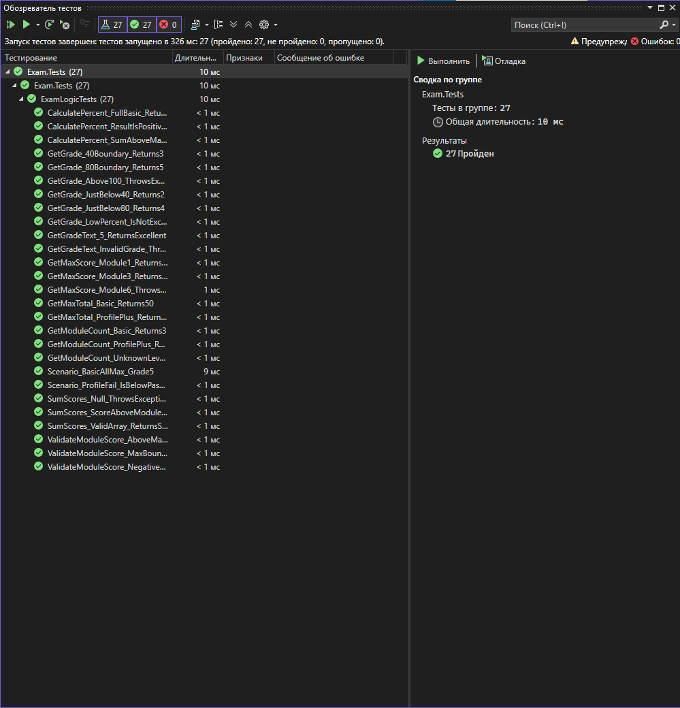

# Задание текущего контроля — МДК.01.02

**Поддержка и тестирование программных модулей**

- **ФИО:** Прокофьев Матвей Артёмович
- **Вариант:** 1 — Подсчёт баллов демонстрационного экзамена
- **Проект:** Приложение WPF (.NET Framework)

